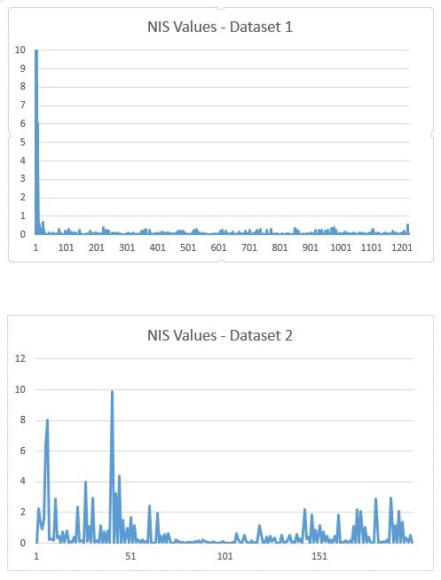

# Unscented Kalman Filter Project
---
#### This project implements Unscented Kalman Filter in C++ for Radar and Lidar data. The Unscented Kalman filter estimates positions and velocities in the x and y directions.

#### Where the Extended Kalman Filter linearizes the system under deployment, the Unscented Kalman Filter closely represents the actual model in use, of the system. For this reason it converges faster and gives values closer to ground truth values especially for non-straight line motion. 

## Dependencies
###### Works only with linux

* cmake >= 3.5
 * [click here for installation instructions](https://cmake.org/install/)
* make >= 4.1
  * Linux: make is installed by default on most Linux distros
 instructions](http://gnuwin32.sourceforge.net/packages/make.htm)
* gcc/g++ >= 5.4
  * Linux: gcc / g++ is installed by default on most Linux distros

  ## Basic Build Instructions
  1. Clone this repo.
  2. Make a build directory: `mkdir build && cd build`
  3. Compile: `cmake .. && make`
  4. Run it: `./ExtendedKF path/to/input.txt path/to/output.txt`. You can find
     some sample inputs in 'data/'.
      - eg. `./ExtendedKF ../data/sample-laser-radar-measurement-data-1.txt output.txt`

## Files In The Project

The project contains the following folders:
* Data: Two files containing samples of Lidar and Radar data.
* src: Contains are the c++ code that implements the kalman filer

## Consistency Of The Algorithm

To check the consistency of the algorithm the NIS score is calculated at each measurement. For Chi-Sq distribution the 95th percentile values for 3 degrees of freedom are below 7.81 and for 2 degrees of freedom are below 5.99. These would apply to Radar and Laser data, respectively. The values of the process noise were tuned so that majority of NIS values fall below 5.99 since that is the lower threshold. This values are given in the graphs below:

